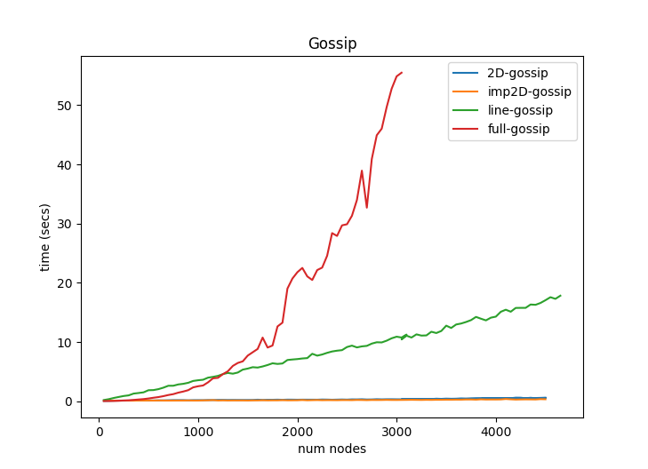
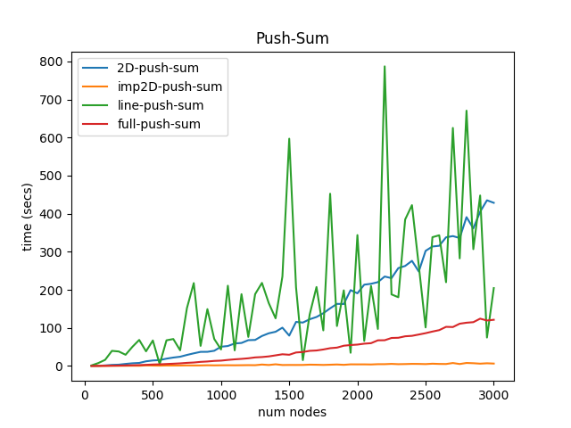

# Gossip

## Team

Patrick Emami (UFID - 70923125)

## Running

Build with 

  `mix escript.build`
    
Run with

  `./project2 --numNodes NUM_NODES --topology {line|2D|imp2D|full} --algorithm {gossip|push-sum}`
    
## What I Did

I implemented [Gossip](https://en.wikipedia.org/wiki/Gossip_protocol) and [Push-Sum](http://www.inf.fu-berlin.de/lehre/WS11/Wireless/Lectures/lecture13.pdf) for a line of nodes, 2D grid, improper 2D grid, and a fully-connected graph of nodes. 
The largest networks I tested on had approximately 4500 nodes. 

## Interesting Discoveries

In the line topology with Gossip, if the number of messages required to have a node stop transmitting the rumor is too low ("N"), it is possible to never converge. This occurs when a node receives the rumor, then passes back the rumor every time until it receives its N'th message, at which point it shuts down without having passed on the rumor. To combat this, I would have to increase N to make the probability of this happening incredibly small.

Also, for the push-sum algorithm and line topology, the time to convergence essentially exhibits random walk behavior. This is seen in the highly-varying times in the push-sum plot. 

In the gossip algorithm, I had to "kill off" a node if all of its neighbors stopped sending messages. I defined convergence as the time when all nodes have stopped transmitting messages. In push-sum, I defined convergence as the time when *any* node has a sum-estimate within the required precision (10e-10). 

## Results

